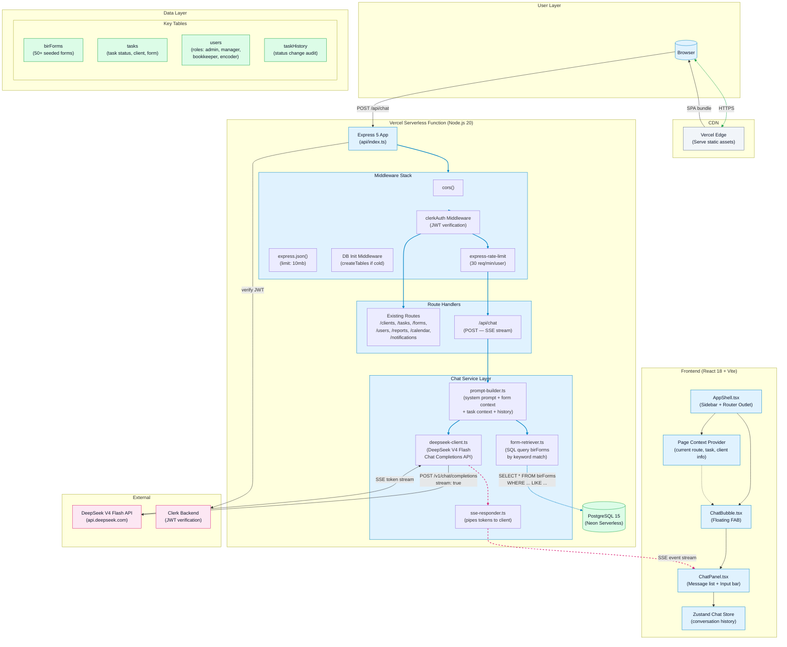

# Epic Architecture: AI Bookkeeper Chatbot

> **Status**: Draft  
> **Date**: 2026-06-01  
> **PRD**: `docs/prd-ai-chatbot.md`  

---

## 1. Epic Architecture Overview

Add an AI-powered chat assistant to the existing Book Keeper Dashboard. The chatbot embeds as a floating bubble in the React frontend, streams responses via SSE through the existing Express serverless function, and grounds its answers on live BIR form data queried from PostgreSQL via Drizzle. The LLM layer uses DeepSeek V4 Flash for cost-effective, fast reasoning without requiring any new infrastructure (no vector DB, no message queue, no additional services).

The architecture follows the existing monolith-with-serverless pattern: the chat route lives in the same Express app as all other API routes, shares the same Clerk auth middleware, and deploys on Vercel zero-config alongside the rest of the application.

---

## 2. System Architecture Diagram



### Request Flow

```
Browser                          Express (Vercel)                   DeepSeek API
   │                                    │                               │
   │  1. POST /api/chat                 │                               │
   │  {message, history, context}       │                               │
   │───────────────────────────────────>│                               │
   │                                    │  2. Verify JWT (Clerk)        │
   │                                    │──────────────────────────────>│
   │                                    │<──────────────────────────────│
   │                                    │                               │
   │                                    │  3. Query birForms for        │
   │                                    │     matching form context     │
   │                                    │────┐                          │
   │                                    │    │ SQL LIKE on              │
   │                                    │<───┘ formCode/name           │
   │                                    │                               │
   │                                    │  4. Build prompt              │
   │                                    │     (system + form context    │
   │                                    │      + task context + history)│
   │                                    │                               │
   │                                    │  5. POST /v1/chat/completions │
   │                                    │     stream: true              │
   │                                    │──────────────────────────────>│
   │                                    │                               │
   │  6. SSE: event="token"             │  6. SSE: {token: "..."}       │
   │<═══════════════════════════════════│<══════════════════════════════│
   │          (streaming)               │          (streaming)          │
   │                                    │                               │
   │  7. SSE: event="done"              │                               │
   │<═══════════════════════════════════│                               │
   │                                    │                               │
```

---

## 3. High-Level Features & Technical Enablers

### Features

| ID | Feature | Phase | Description |
|----|---------|-------|-------------|
| F-01 | Floating Chat Bubble UI | MVP | FAB button + slide-out panel rendered in `AppShell.tsx`, accessible from all routes |
| F-02 | Message Input & Rendering | MVP | Text input with send button + streaming message bubbles with markdown support |
| F-03 | BIR Form Q&A | MVP | LLM answers form code, deadline, frequency, category queries grounded in live DB data |
| F-04 | SSE Streaming Response | MVP | Real-time token rendering via Server-Sent Events; no waiting for full response |
| F-05 | Rate Limiting & Cost Control | MVP | 30 req/min/user cap, 500-token max output, per-user daily spend tracking |
| F-06 | Task Context Awareness | v1.1 | Chat receives current taskId, status, clientName to give status-specific suggestions |
| F-07 | Dashboard Q&A | v1.1 | Answer "how many pending tasks?" by querying task stats via existing API |
| F-08 | Conversation Persistence | v1.2 | Zustand store persists history across route navigations; "New Chat" button |
| F-09 | User Feedback | v1.2 | Thumbs up/down after each response; stored for quality monitoring |
| F-10 | Admin Dashboard | v2.0 | Usage stats: total chats, token spend, top questions, satisfaction rate |

### Technical Enablers

| ID | Enabler | Justification |
|----|---------|---------------|
| E-01 | `DEEPSEEK_API_KEY` env var | API key for DeepSeek V4 Flash, set in Vercel dashboard and `.env.example` |
| E-02 | `routes/chat.ts` Express route | New route: `POST /api/chat` with SSE streaming response |
| E-03 | `lib/chat/prompt-builder.ts` | Constructs system prompt with BIR form context + task context + history |
| E-04 | `lib/chat/form-retriever.ts` | Queries `birForms` table by keyword match (SQL `LIKE` on formCode/name) |
| E-05 | `lib/chat/deepseek-client.ts` | Thin wrapper around DeepSeek Chat Completions API with streaming support |
| E-06 | `lib/chat/sse-responder.ts` | Utility to pipe OpenAI-compatible SSE chunks to Express response |
| E-07 | `lib/chat/types.ts` | Shared types: `ChatMessage`, `ChatRequest`, `ChatContext`, `SSEEvent` |
| E-08 | `components/chat/ChatBubble.tsx` | Floating action button (FAB) component rendered in AppShell |
| E-09 | `components/chat/ChatPanel.tsx` | Slide-out chat panel with message list, input bar, streaming renderer |
| E-10 | `components/chat/MessageBubble.tsx` | Single message bubble (user vs assistant styling, markdown rendering) |
| E-11 | `stores/chat-store.ts` | Zustand store for conversation history + loading state |
| E-12 | `hooks/useChat.ts` | Hook managing SSE connection, message send, stream parsing, error handling |
| E-13 | `express-rate-limit` package | Server-side rate limiting per user (add to existing dependencies) |
| E-14 | TypeScript types in `server/src/types/` | `ChatRequest`, `ChatResponse`, `ChatMessage` types shared or mirrored |

---

## 4. Technology Stack

| Layer | Technology | Version | Purpose |
|-------|-----------|---------|---------|
| **LLM** | DeepSeek V4 Flash | latest | Core AI reasoning; OpenAI-compatible API, streaming support |
| **Frontend** | React | 18.3.x | Component rendering; no new framework needed |
| **Styling** | Tailwind CSS | 3.4.x | Chat panel styling matches existing design system |
| **Icons** | Lucide React | 0.424.x | Chat/send/minimize icons; already in project |
| **State** | Zustand | 4.5.x | Conversation history store; already in project |
| **Server** | Express | 5.2.x | Chat route handler; already in project |
| **ORM** | Drizzle | 0.45.x | BIR form queries; already in project |
| **DB** | PostgreSQL (Neon) | 15 | Form data + task context; already in project |
| **Auth** | Clerk | latest | Reuse existing JWT verification middleware |
| **Deploy** | Vercel Serverless | — | Existing serverless function; no new infra |
| **Rate Limit** | express-rate-limit | latest | Per-user rate limiting for chat endpoint |
| **Streaming** | Server-Sent Events | native | No extra dependencies; built into Express/Node |

### New npm Dependencies

| Package | Layer | Reason |
|---------|-------|--------|
| `express-rate-limit` | server | Rate limiting the chat endpoint per user |
| `openai` | server | Official OpenAI-compatible client; works with DeepSeek's API (`baseURL: "https://api.deepseek.com"`) |

### New Env Variables

| Variable | Required | Description |
|----------|----------|-------------|
| `DEEPSEEK_API_KEY` | Yes | DeepSeek API key for V4 Flash model |
| `CHAT_RATE_LIMIT` | No | Max requests per minute per user (default: 30) |
| `CHAT_MAX_TOKENS` | No | Max output tokens per response (default: 500) |

---

## 5. Technical Value

**Value: High**

| Dimension | Rating | Justification |
|-----------|--------|---------------|
| User Productivity | High | Eliminates context-switching to search BIR forms or accounting references |
| Differentiation | High | AI assistant embedded in a niche dashboard (PH bookkeeping) is a competitive advantage |
| Code Reuse | High | Reuses existing middleware, DB, auth, and deployment — zero new infrastructure |
| Maintainability | Medium | New code is self-contained in `lib/chat/` and `components/chat/` — no existing code modified |
| Cost | Low | DeepSeek V4 Flash is ~$0.14/M input tokens; at 30 req/min × 500 tokens = ~$3/day max |

---

## 6. T-Shirt Size Estimate

**Size: M** (Medium)

**Breakdown:**

| Dimension | Size | Reason |
|-----------|------|--------|
| Frontend UI | S | Single component tree (ChatBubble, ChatPanel, MessageBubble + Zustand store) |
| Backend Route | S | One new Express route, streaming SSE, shared middleware |
| LLM Integration | S | Thin client wrapper; DeepSeek is OpenAI-compatible |
| Form Retrieval | XS | Simple SQL `LIKE` query against 50 rows — no vector DB |
| Prompt Engineering | M | Requires iteration to get BIR form accuracy + task context right |
| Testing | M | Need tests for: form retrieval accuracy, prompt construction, SSE parsing, rate limiting |
| **Total** | **M** | Core scope is small, but prompt quality iteration + SSE streaming add complexity |

**Phased breakdown:**

```
MVP  ── S  (chat UI + BIR Q&A + SSE streaming)
v1.1 ── XS (task context awareness)
v1.2 ── XS (persistence + feedback)
v2.0 ── M  (document upload / OCR)
```
