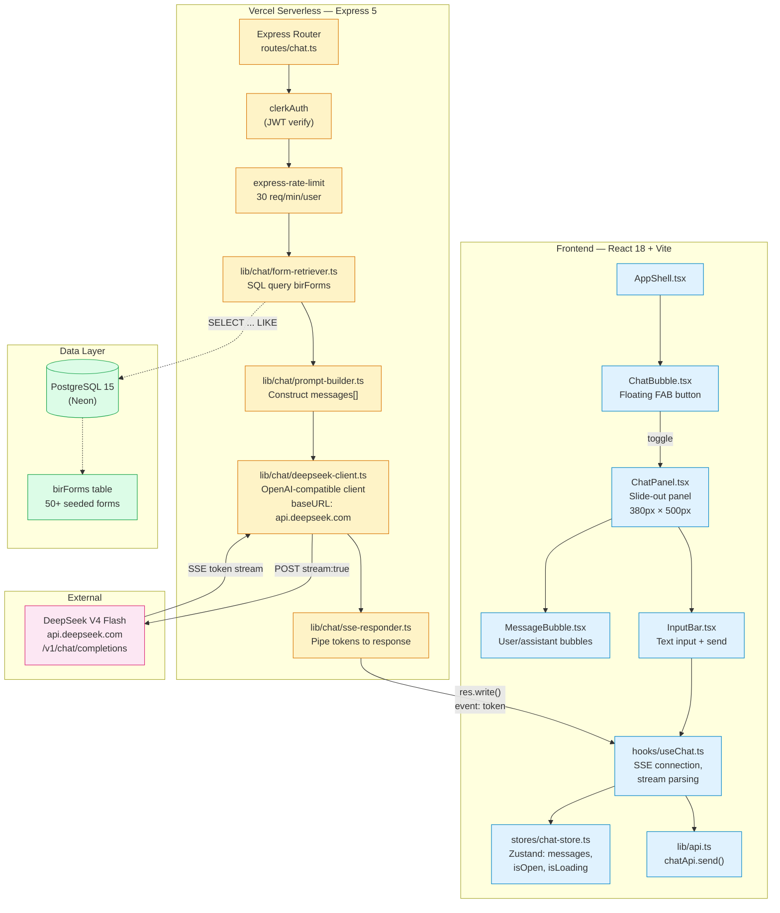
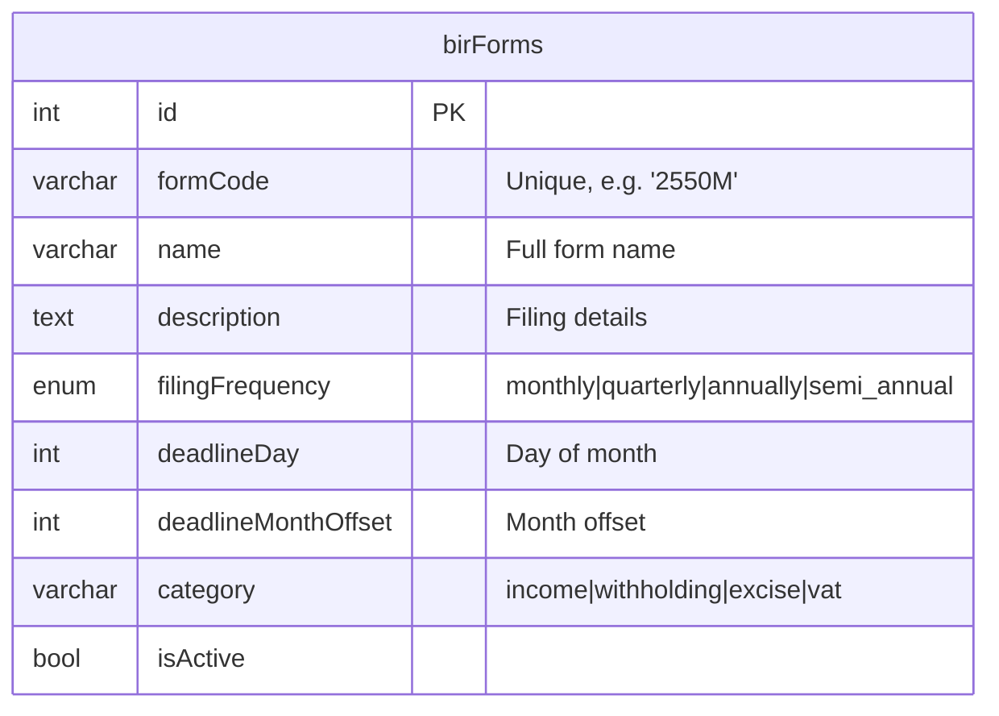
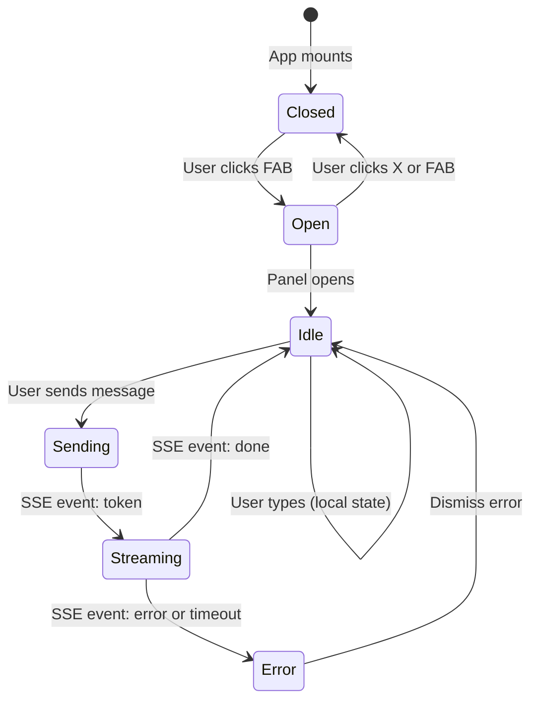

# Implementation Plan: Floating Chat Bubble — MVP

> **Epic**: AI Bookkeeper Chatbot  
> **Feature**: Floating Chat Bubble (MVP)  
> **PRD**: `docs/prd-ai-chatbot.md`  
> **Arch**: `docs/ways-of-work/plan/ai-bookkeeper-chatbot/arch.md`  

---

## Goal

Add an AI-powered chat assistant to the Book Keeper Dashboard. Users click a floating action button (FAB) in the bottom-right corner to open a chat panel, type questions about BIR forms or accounting, and receive streaming responses from DeepSeek V4 Flash. The server augments the prompt with live BIR form data from the database so answers are grounded in actual form codes, deadlines, and frequencies. The MVP covers the full round-trip: UI → API → LLM → streaming response, with rate limiting and cost controls.

---

## Requirements

- **F-01 Floating Chat Bubble UI**: FAB button in bottom-right corner, visible on all authenticated pages. Click toggles a 380px-wide slide-out panel.
- **F-02 Message Input & Rendering**: Text input with send button. Messages render as styled bubbles (user left, assistant right). Assistant messages stream tokens in real-time. Basic markdown rendering (bold, lists, code).
- **F-03 BIR Form Q&A**: Server queries `birForms` table for forms matching the user's question keywords. Top 5 matches injected into the system prompt. LLM answers grounded in that context.
- **F-04 SSE Streaming Response**: Server streams tokens via Server-Sent Events. Client parses SSE events and appends tokens progressively to the active message bubble.
- **F-05 Rate Limiting & Cost Control**: 30 requests/min per user, 500-token max output per response, per-user daily spend tracked in logs.

### Non-Goals (MVP)

- Task context awareness (v1.1)
- Conversation persistence across page navigations (v1.2)
- User feedback thumbs up/down (v1.2)
- Document upload / OCR (v2.0)

---

## Technical Considerations

### System Architecture



### Technology Stack

| Layer | Technology | Rationale |
|-------|-----------|-----------|
| **LLM** | DeepSeek V4 Flash | OpenAI-compatible API, ~$0.14/M input tokens, fast streaming |
| **SSE Client** | Native `EventSource` polyfill via `fetch` with streaming | No extra dependency; `EventSource` doesn't support POST, so use `fetch` + `ReadableStream` |
| **Server** | Express 5 + existing app | Same pattern as all other routes; shared Clerk auth middleware |
| **DB** | Drizzle ORM + PostgreSQL | Existing; simple `LIKE` query on 50 rows — no vector DB needed |
| **Rate Limiting** | `express-rate-limit` | New dependency; per-user key via `req.authUser.id` |
| **OpenAI Client** | `openai` npm package | Works with DeepSeek by setting `baseURL`; handles streaming natively |
| **State** | Zustand | Existing pattern; store messages + UI state |
| **Styling** | Tailwind CSS + Lucide | Existing design system |

### Integration Points

| Integration | Type | Details |
|-------------|------|---------|
| `POST /api/chat` | Express route | Registered in `api/index.ts` as `app.use("/api/chat", chatRouter)` |
| `clerkAuth` middleware | Reused | Same JWT verification as all routes; `req.authUser` available |
| `express-rate-limit` | Middleware | Applied per-route to chat only; keyed by `req.authUser.id` |
| Drizzle DB query | Internal | `db.select().from(schema.birForms).where(...)` matching formCode/name |
| DeepSeek API | External | OpenAI SDK with `baseURL: "https://api.deepseek.com"` and `apiKey` from env |

### Deployment Architecture

No changes to existing Vercel deployment. The new chat route lives inside the same `api/index.ts` serverless function. The `openai` and `express-rate-limit` packages are added to the root `package.json` dependencies (they bundle into the serverless function). The `DEEPSEEK_API_KEY` env var is set in Vercel dashboard.

### Scalability

At 30 req/min/user × 500 tokens × ~$0.14/M tokens, daily cost is ~$3 at max usage. No additional infrastructure needed. If usage grows, add response caching for identical questions (hash of message + form context).

---

## Database Schema Design

No new tables required for MVP. The existing `birForms` table is queried read-only.



### Query Pattern

```typescript
// form-retriever.ts — top 5 matches by formCode or name keyword
async function findRelevantForms(query: string, limit = 5) {
  const term = `%${query.toLowerCase().slice(0, 100)}%`;
  return db.select({
    formCode: schema.birForms.formCode,
    name: schema.birForms.name,
    filingFrequency: schema.birForms.filingFrequency,
    deadlineDay: schema.birForms.deadlineDay,
    deadlineMonthOffset: schema.birForms.deadlineMonthOffset,
    category: schema.birForms.category,
  })
    .from(schema.birForms)
    .where(
      and(
        eq(schema.birForms.isActive, true),
        sql`(lower(${schema.birForms.formCode}) like ${term} or lower(${schema.birForms.name}) like ${term})`
      )
    )
    .limit(limit)
    .all();
}
```

---

## API Design

### `POST /api/chat`

**Auth**: Clerk JWT required (same as all routes)  
**Rate Limit**: 30 requests per minute per user  
**Content-Type**: `application/json`

#### Request

```typescript
interface ChatRequest {
  /** Current user message */
  message: string;
  /** Previous turns (last 10). Empty array for first message. */
  history: Array<{
    role: "user" | "assistant";
    content: string;
  }>;
}
```

#### Response (SSE stream)

```
event: token
data: {"token": "BIR"}

event: token
data: {"token": " Form"}

event: token
data: {"token": " 2550M"}

event: done
data: {"usage": {"promptTokens": 420, "completionTokens": 85}}
```

#### Error Responses

```json
// 400 — Validation error
{ "success": false, "error": "Message is required" }

// 429 — Rate limit exceeded
{ "success": false, "error": "Rate limit exceeded. Try again in 2 seconds." }

// 500 — Internal error
{ "success": false, "error": "Failed to get AI response" }
```

#### TypeScript Types

```typescript
// server/src/types/index.ts — add these

interface ChatMessage {
  role: "user" | "assistant" | "system";
  content: string;
}

interface ChatRequest {
  message: string;
  history: Array<Omit<ChatMessage, "system">>;
}

interface ChatUsage {
  promptTokens: number;
  completionTokens: number;
}

interface SSETokenEvent {
  token: string;
}

interface SSEDoneEvent {
  usage: ChatUsage;
}
```

```typescript
// client/src/types/index.ts — add these (mirror for client)

interface ChatMessage {
  id: string;
  role: "user" | "assistant";
  content: string;
  timestamp: number;
}

interface ChatState {
  messages: ChatMessage[];
  isOpen: boolean;
  isLoading: boolean;
  error: string | null;
}
```

---

## Frontend Architecture

### Component Hierarchy

```
AppShell.tsx
├── Sidebar
├── <main>
│   └── <Outlet />  ← existing page content
└── ChatBubble.tsx   ← new, fixed bottom-right
    └── ChatPanel.tsx  ← slide-out panel
        ├── MessageBubble.tsx  ← individual message
        └── InputBar.tsx  ← text input + send button
```

### Component Specifications

#### `ChatBubble.tsx` — Floating Action Button

```
┌─────────────────────────────────────────────┐
│                                             │
│                                    ┌──────┐ │
│                                    │  💬  │ │
│                                    │ FAB  │ │
│                                    └──────┘ │
└─────────────────────────────────────────────┘
```

- Fixed position: `bottom-6 right-6`, `z-50`
- Lucide `MessageCircle` icon
- Click toggles `chatStore.isOpen`
- Badge indicator (optional, not in MVP)
- Animated entrance (scale from 0 to 1, framer-motion)

```tsx
// Pseudocode
export function ChatBubble() {
  const { isOpen, toggle } = useChatStore();
  return (
    <div className="fixed bottom-6 right-6 z-50">
      <button onClick={toggle} className="...">
        {isOpen ? <X /> : <MessageCircle />}
      </button>
    </div>
  );
}
```

#### `ChatPanel.tsx` — Slide-out Panel

```
┌─────────────────────────────────┐
│  ┌─────── Chat ──────── [X] ─┐ │
│  │ MessageBubble (user)       │ │
│  │ MessageBubble (assistant)  │ │
│  │  · streaming tokens...     │ │
│  │                            │ │
│  │                            │ │
│  ├────────────────────────────┤ │
│  │ [ InputBar           ║ ]  │ │
│  └────────────────────────────┘ │
└─────────────────────────────────┘
```

- Fixed position: `bottom-24 right-6`, `z-50`
- Width: 380px, Max-height: 500px
- Header with "Chat" title + close button
- Scrollable message list (auto-scroll to bottom on new message)
- Footer with InputBar
- Animated slide-in from bottom-right

#### `MessageBubble.tsx`

- User messages: right-aligned, primary color background
- Assistant messages: left-aligned, muted background
- Streaming state: animated cursor/ellipsis while loading
- Basic markdown rendering via simple regex (bold `**`, code `` ` ``, lists `-`)
- Avatar/icon for assistant (Bot icon from Lucide)

#### `InputBar.tsx`

- Text input with placeholder "Ask about BIR forms..."
- Send button (Lucide `Send` icon)
- Disabled while `isLoading`
- Submit on Enter or button click
- Min height 40px, grows with content (max 120px)

### State Flow Diagram



### Zustand Store

```typescript
// stores/chat-store.ts
import { create } from "zustand";
import type { ChatMessage } from "@/types";

interface ChatState {
  messages: ChatMessage[];
  isOpen: boolean;
  isLoading: boolean;
  error: string | null;

  toggle: () => void;
  open: () => void;
  close: () => void;
  addMessage: (msg: ChatMessage) => void;
  appendToken: (token: string) => void;
  setLoading: (loading: boolean) => void;
  setError: (error: string | null) => void;
  clear: () => void;
}

export const useChatStore = create<ChatState>((set, get) => ({
  messages: [],
  isOpen: false,
  isLoading: false,
  error: null,

  toggle: () => set((s) => ({ isOpen: !s.isOpen })),
  open: () => set({ isOpen: true }),
  close: () => set({ isOpen: false }),
  addMessage: (msg) => set((s) => ({ messages: [...s.messages, msg] })),
  appendToken: (token) => set((s) => {
    const msgs = [...s.messages];
    const last = msgs[msgs.length - 1];
    if (last?.role === "assistant") {
      msgs[msgs.length - 1] = { ...last, content: last.content + token };
    }
    return { messages: msgs };
  }),
  setLoading: (loading) => set({ isLoading: loading, error: loading ? null : get().error }),
  setError: (error) => set({ error, isLoading: false }),
  clear: () => set({ messages: [], error: null }),
}));
```

### `useChat` Hook

```typescript
// hooks/useChat.ts
import { useChatStore } from "@/stores/chat-store";
import { chatApi } from "@/lib/api";

export function useChat() {
  const { addMessage, appendToken, setLoading, setError, messages } = useChatStore();

  async function send(message: string) {
    const userMsg: ChatMessage = {
      id: crypto.randomUUID(),
      role: "user",
      content: message,
      timestamp: Date.now(),
    };
    addMessage(userMsg);
    setLoading(true);

    try {
      const history = messages.map((m) => ({ role: m.role, content: m.content }));
      const assistantId = crypto.randomUUID();
      addMessage({ id: assistantId, role: "assistant", content: "", timestamp: Date.now() });
      setLoading(true);

      await chatApi.sendStream(message, history, {
        onToken: (token) => appendToken(token),
        onDone: () => setLoading(false),
        onError: (err) => setError(err.message),
      });
    } catch (err: any) {
      setError(err.message || "Failed to send message");
    }
  }

  return { send, messages: useChatStore((s) => s.messages) };
}
```

### API Client Addition

```typescript
// lib/api.ts — add to existing file

export const chatApi = {
  sendStream: async (
    message: string,
    history: Array<{ role: string; content: string }>,
    callbacks: {
      onToken: (token: string) => void;
      onDone: () => void;
      onError: (err: Error) => void;
    }
  ) => {
    const token = await getClerkToken();
    const res = await fetch(`${API_BASE}/chat`, {
      method: "POST",
      headers: {
        "Content-Type": "application/json",
        ...(token ? { Authorization: `Bearer ${token}` } : {}),
      },
      body: JSON.stringify({ message, history }),
    });

    if (!res.ok) {
      const err = await res.json().catch(() => ({ error: "Request failed" }));
      throw new Error(err.error || `HTTP ${res.status}`);
    }

    const reader = res.body?.getReader();
    if (!reader) throw new Error("No response body");

    const decoder = new TextDecoder();
    let buffer = "";

    while (true) {
      const { done, value } = await reader.read();
      if (done) break;

      buffer += decoder.decode(value, { stream: true });
      const lines = buffer.split("\n");
      buffer = lines.pop() || "";

      for (const line of lines) {
        if (line.startsWith("data: ")) {
          try {
            const data = JSON.parse(line.slice(6));
            if (data.token) callbacks.onToken(data.token);
            if (data.usage) callbacks.onDone();
          } catch {
            // skip malformed lines
          }
        }
      }
    }
    callbacks.onDone();
  },
};
```

---

## Server Architecture

### File Structure

```
server/src/
├── routes/
│   └── chat.ts             ← NEW: POST /api/chat handler
├── lib/
│   └── chat/
│       ├── types.ts        ← NEW: ChatMessage, ChatRequest, etc.
│       ├── form-retriever.ts    ← NEW: SQL query for birForms
│       ├── prompt-builder.ts    ← NEW: system prompt construction
│       ├── deepseek-client.ts   ← NEW: DeepSeek API client
│       └── sse-responder.ts     ← NEW: SSE write utilities
```

### `routes/chat.ts`

```typescript
import { Router } from "express";
import rateLimit from "express-rate-limit";
import { findRelevantForms } from "../lib/chat/form-retriever.js";
import { buildPrompt } from "../lib/chat/prompt-builder.js";
import { streamFromDeepSeek } from "../lib/chat/deepseek-client.js";
import { writeSSE, writeSSEError } from "../lib/chat/sse-responder.js";

const router = Router();

const chatLimiter = rateLimit({
  windowMs: 60 * 1000,       // 1 minute
  max: parseInt(process.env.CHAT_RATE_LIMIT || "30"),
  keyGenerator: (req) => String((req as any).authUser?.id || "anonymous"),
  message: { success: false, error: "Rate limit exceeded. Try again in 2 seconds." },
});

router.post("/", chatLimiter, async (req, res) => {
  try {
    const { message, history } = req.body;
    if (!message || typeof message !== "string" || !message.trim()) {
      return res.status(400).json({ success: false, error: "Message is required" });
    }

    const user = (req as any).authUser;
    const forms = await findRelevantForms(message);
    const messages = buildPrompt({
      userMessage: message.trim().slice(0, 2000),
      history: (history || []).slice(-10),
      forms,
      userRole: user?.role,
    });

    res.setHeader("Content-Type", "text/event-stream");
    res.setHeader("Cache-Control", "no-cache");
    res.setHeader("Connection", "keep-alive");
    res.setHeader("X-Accel-Buffering", "no");  // disable nginx buffering

    await streamFromDeepSeek(messages, {
      onToken: (token) => writeSSE(res, { token }),
      onDone: (usage) => {
        writeSSE(res, { usage });
        res.end();
      },
    });
  } catch (err: any) {
    console.error("Chat error:", err);
    if (!res.headersSent) {
      return res.status(500).json({ success: false, error: "Failed to get AI response" });
    }
    writeSSEError(res, err.message || "Internal error");
    res.end();
  }
});

export default router;
```

### `lib/chat/form-retriever.ts`

```typescript
import { db, schema } from "../../db/adapter.js";
import { and, eq, sql } from "drizzle-orm";

interface FormMatch {
  formCode: string;
  name: string;
  filingFrequency: string;
  deadlineDay: number;
  deadlineMonthOffset: number;
  category: string;
}

export async function findRelevantForms(query: string, limit = 5): Promise<FormMatch[]> {
  const term = `%${query.toLowerCase().slice(0, 100)}%`;
  return db.select({
    formCode: schema.birForms.formCode,
    name: schema.birForms.name,
    filingFrequency: schema.birForms.filingFrequency,
    deadlineDay: schema.birForms.deadlineDay,
    deadlineMonthOffset: schema.birForms.deadlineMonthOffset,
    category: schema.birForms.category,
  })
    .from(schema.birForms)
    .where(
      and(
        eq(schema.birForms.isActive, true),
        sql`(lower(${schema.birForms.formCode}) like ${term} or lower(${schema.birForms.name}) like ${term})`
      )
    )
    .limit(limit)
    .all();
}
```

### `lib/chat/prompt-builder.ts`

```typescript
interface BuildPromptInput {
  userMessage: string;
  history: Array<{ role: string; content: string }>;
  forms: Array<{
    formCode: string;
    name: string;
    filingFrequency: string;
    deadlineDay: number;
    deadlineMonthOffset: number;
    category: string;
  }>;
  userRole?: string;
}

export function buildPrompt(input: BuildPromptInput) {
  const formContext = input.forms.length > 0
    ? input.forms.map((f) =>
        `- BIR Form ${f.formCode}: ${f.name} | Frequency: ${f.filingFrequency} | Deadline: Day ${f.deadlineDay}, offset ${f.deadlineMonthOffset} month(s) | Category: ${f.category}`
      ).join("\n")
    : "No matching forms found in the database.";

  const systemPrompt = [
    "You are an AI bookkeeping assistant for a Philippine accounting dashboard.",
    "You help bookkeepers with BIR form information and basic accounting Q&A.",
    "",
    "Rules:",
    "- Be concise — 2-3 sentences max unless asked for detail.",
    "- If you don't know, say \"I'm not sure — consult a CPA for this.\"",
    "- Never fabricate BIR form data. Only use the context provided below.",
    "- Never give investment or legal advice.",
    "- Always prefix BIR form codes with \"BIR Form \" (e.g., \"BIR Form 2550M\").",
    "",
    "BIR Forms in database (top matches for this query):",
    formContext,
    "",
    `User role: ${input.userRole || "unknown"}`,
    "AI-generated — verify with a qualified professional.",
  ].join("\n");

  const messages: Array<{ role: string; content: string }> = [
    { role: "system", content: systemPrompt },
    ...input.history,
    { role: "user", content: input.userMessage },
  ];

  return messages;
}
```

### `lib/chat/deepseek-client.ts`

```typescript
import OpenAI from "openai";

const client = new OpenAI({
  baseURL: "https://api.deepseek.com",
  apiKey: process.env.DEEPSEEK_API_KEY || "",
});

const MAX_TOKENS = parseInt(process.env.CHAT_MAX_TOKENS || "500");

interface StreamCallbacks {
  onToken: (token: string) => void;
  onDone: (usage: { promptTokens: number; completionTokens: number }) => void;
}

export async function streamFromDeepSeek(
  messages: Array<{ role: string; content: string }>,
  callbacks: StreamCallbacks
) {
  const stream = await client.chat.completions.create({
    model: "deepseek-chat",
    messages: messages as any,
    stream: true,
    max_tokens: MAX_TOKENS,
    temperature: 0.3,
  });

  let promptTokens = 0;
  let completionTokens = 0;

  for await (const chunk of stream) {
    const token = chunk.choices?.[0]?.delta?.content;
    if (token) {
      callbacks.onToken(token);
    }
    if (chunk.usage) {
      promptTokens = chunk.usage.prompt_tokens;
      completionTokens = chunk.usage.completion_tokens;
    }
  }

  callbacks.onDone({ promptTokens, completionTokens });

  // Log usage
  console.log(
    `[Chat] tokens: ${promptTokens} in / ${completionTokens} out | model: deepseek-chat`
  );
}
```

### `lib/chat/sse-responder.ts`

```typescript
import type { Response } from "express";

export function writeSSE(res: Response, data: Record<string, unknown>) {
  res.write(`data: ${JSON.stringify(data)}\n\n`);
}

export function writeSSEError(res: Response, error: string) {
  res.write(`data: ${JSON.stringify({ error })}\n\n`);
}
```

---

## Route Registration

Add to `api/index.ts`:

```typescript
import chatRouter from "../server/src/routes/chat.js";

// After existing route registrations
app.use("/api/chat", chatRouter);
```

---

## Dependencies

### New npm Packages

```bash
# From root (shared with serverless function)
npm install express-rate-limit openai
```

### New Env Variables

Set in Vercel dashboard and `.env`:

```env
DEEPSEEK_API_KEY=sk-your-key-here
CHAT_RATE_LIMIT=30
CHAT_MAX_TOKENS=500
```

---

## Implementation Order

| Step | File | Description | Est. |
|------|------|-------------|------|
| 1 | `server/src/lib/chat/types.ts` | Define ChatMessage, ChatRequest, SSE event types | 15m |
| 2 | `server/src/lib/chat/form-retriever.ts` | SQL query for birForms by keyword | 20m |
| 3 | `server/src/lib/chat/sse-responder.ts` | SSE write utility functions | 10m |
| 4 | `server/src/lib/chat/prompt-builder.ts` | System prompt + context assembly | 25m |
| 5 | `server/src/lib/chat/deepseek-client.ts` | OpenAI SDK wrapper for DeepSeek | 30m |
| 6 | `server/src/routes/chat.ts` | POST /api/chat with rate limiting + SSE | 40m |
| 7 | `api/index.ts` | Register chat route | 5m |
| 8 | Install deps | `npm install express-rate-limit openai` | 5m |
| 9 | `client/src/stores/chat-store.ts` | Zustand store for chat state | 20m |
| 10 | `client/src/lib/api.ts` | Add `chatApi.sendStream()` | 25m |
| 11 | `client/src/hooks/useChat.ts` | SSE connection + stream parsing hook | 30m |
| 12 | `client/src/components/chat/MessageBubble.tsx` | Single message bubble | 20m |
| 13 | `client/src/components/chat/InputBar.tsx` | Text input + send button | 20m |
| 14 | `client/src/components/chat/ChatPanel.tsx` | Slide-out panel with header, list, input | 35m |
| 15 | `client/src/components/chat/ChatBubble.tsx` | FAB button component | 15m |
| 16 | `client/src/components/layout/AppShell.tsx` | Add ChatBubble after Outlet | 5m |
| 17 | `client/src/types/index.ts` | Add ChatMessage, ChatState types | 10m |
| — | **Total** | | **~5.5h** |

---

## Security

- `DEEPSEEK_API_KEY` stored in Vercel env vars — never sent to client.
- Clerk auth gate — only authenticated users can call `/api/chat`.
- Rate-limited per user (30 req/min) to prevent abuse and cost spikes.
- User messages capped at 2000 characters server-side.
- Output capped at 500 tokens.
- System prompt includes disclaimer: "AI-generated — verify with a qualified professional."
- No PII stored — conversation history is ephemeral (Zustand in-memory only).

## Performance

- Streaming via SSE eliminates waiting for full response — first token renders in ~500ms (warm) to ~2s (cold).
- BIR form query is a simple indexed `LIKE` on 50 rows — completes in <5ms.
- Rate limiting is in-memory (no Redis needed at this scale).
- OpenAI/DeepSeek SDK handles connection pooling and retries internally.

## Testing

| Test | Scope | Method |
|------|-------|--------|
| Form retrieval | Unit | Test `findRelevantForms` with known form codes and edge cases (empty, no match) |
| Prompt building | Unit | Test `buildPrompt` produces valid messages array with correct system prompt |
| SSE parsing | Unit | Test `chatApi.sendStream` with mock ReadableStream |
| Chat route | Integration | Test POST /api/chat with mock DeepSeek (nock/intercept) — verify SSE format |
| Rate limiting | Integration | Send 31 requests in rapid succession — verify 429 on the 31st |
| ChatBubble render | Component | Test FAB renders, click toggles panel, close button works |
| Streaming render | Component | Test that tokens append to assistant message progressively |
